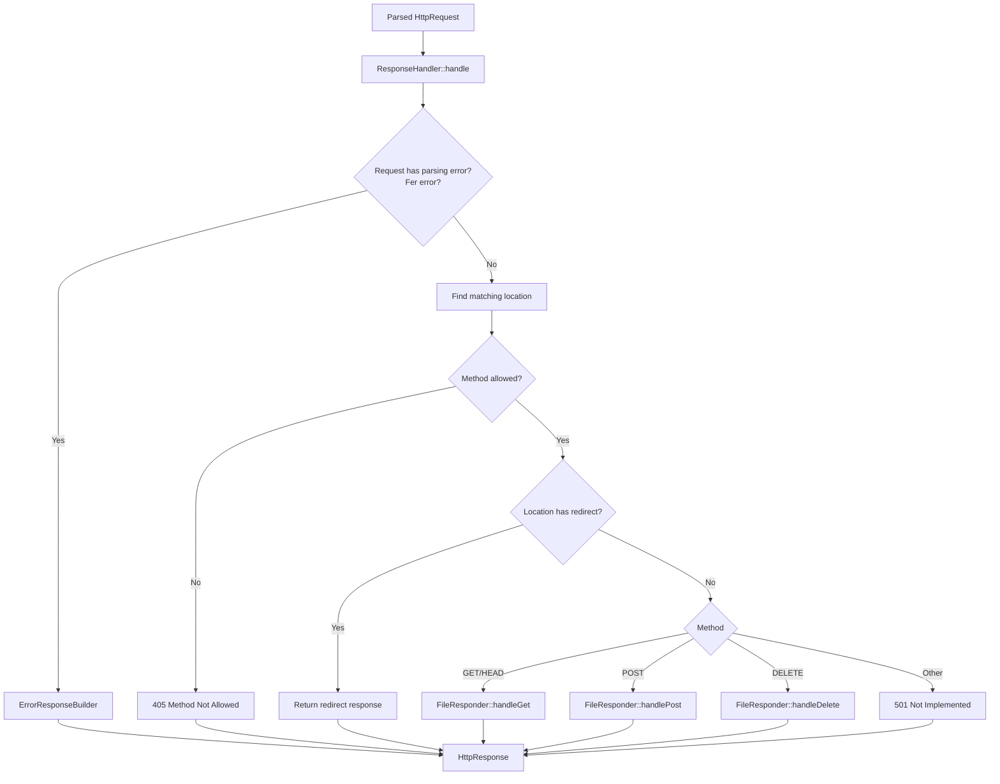

# Response Section Overview

## Short Version

1. The request is parsed.
2. The server chooses the right server block and location block (from config file).
3. *ResponseHandler* decides what kind of response should be created.
4. A specialized responder builds the body and headers.
5. HttpResponse turns everything into the final raw HTTP message.

## Big Picture

The response code is responsible for turning a valid request into a valid HTTP reply. That reply can be:

- a normal file response
- an auto-generated directory listing (autoindex)
- a redirect
- an error page
- a response for POST or DELETE

The main entry point is *ResponseHandler*. From there, the code branches based on method, location rules, and filesystem state.

## Main Flow

## What Each Class Does

### ResponseHandler

ResponseHandler is the traffic controller.

It decides:

- whether the request already has an error state
- which location block applies
- whether the method is allowed
- whether the location is a redirect
- which responder should handle the request

Key file: [src/response/ResponseHandler.cpp](src/response/ResponseHandler.cpp)

### FileResponder

FileResponder is a thin dispatcher for filesystem-based responses.

It forwards the request to:

- GetResponder for GET and HEAD
- PostResponder for POST
- DeleteResponder for DELETE

It also contains shared helpers such as safe URI checking and path helpers.

Key file: [src/response/FileResponder.cpp](src/response/FileResponder.cpp)

### GetResponder

GetResponder handles normal file reads and directory requests.

It does four important things:

1. Builds the filesystem path for the request.
2. Checks whether the path is a directory.
3. If it is a directory, tries to serve an index file.
4. If no index file exists, optionally generates an autoindex page.

Key file: [src/response/GetResponder.cpp](src/response/GetResponder.cpp)

### AutoIndex

AutoIndex builds an HTML directory listing from the filesystem contents.

It:

- opens the target directory
- reads entries
- sorts them alphabetically
- builds links for files and subdirectories

Key file: [src/response/AutoIndex.cpp](src/response/AutoIndex.cpp)

### ErrorResponseBuilder

ErrorResponseBuilder creates error pages.

It first checks whether the config defines a custom error page. If not, it generates a default HTML error page.

Key file: [src/response/ErrorResponseBuilder.cpp](src/response/ErrorResponseBuilder.cpp)

### ResponseFactory

ResponseFactory creates the base HTTP response object.

It sets common headers such as:

- Date
- Server
- Connection
- X-Content-Type-Options

Key file: [src/response/ResponseFactory.cpp](src/response/ResponseFactory.cpp)

### HttpResponse

HttpResponse stores the final status line, headers, and body.

When getResponse() is called, it serializes everything into the raw HTTP message sent to the client.

Key file: [src/response/HttpResponse.cpp](src/response/HttpResponse.cpp)

## GET and HEAD in Detail

GET and HEAD share the same content generation path.

The difference is:

- GET returns headers plus body
- HEAD returns headers only

The sequence is:

1. ResponseHandler accepts the method.
2. FileResponder forwards to GetResponder.
3. GetResponder resolves the filesystem path.
4. If the path is a directory, it calls handleDirectory().
5. If the path is a file, it reads the file and returns it.

### Directory handling order

For directories, the current order is:

1. Look for a configured index file.
2. If no index exists, redirect to a slash-terminated URI when needed.
3. If autoindex is enabled, build a directory listing.
4. Otherwise return an error.

That order matters because index files take priority over autoindex.

## How Path Resolution Works

The request URI is turned into a filesystem path using the configured document root.

The document root comes from:

1. the location root, if the location defines one
2. otherwise the server root

Then the URI is joined to that root.

This is why configuration affects what directory or file is actually opened on disk.

## Error Handling

There are two main error sources:

1. Request parsing or validation problems
2. Runtime request handling problems

Examples:

- malformed request -> 400
- forbidden file access -> 403
- missing resource -> 404
- method not allowed -> 405
- unsupported method -> 501

If a custom error page exists in the server config, the error builder uses it. Otherwise it falls back to a generated HTML page.

## Practical Example

If a client requests a directory like /media/images/:

1. The request is parsed.
2. ResponseHandler chooses the matching location.
3. GET goes to GetResponder.
4. GetResponder sees that the target is a directory.
5. It checks for a configured index file.
6. If no index file exists and autoindex is on, it generates a directory listing.

If an index file exists, it wins before autoindex.

## Useful Files

- [src/response/ResponseHandler.cpp](src/response/ResponseHandler.cpp)
- [src/response/FileResponder.cpp](src/response/FileResponder.cpp)
- [src/response/GetResponder.cpp](src/response/GetResponder.cpp)
- [src/response/AutoIndex.cpp](src/response/AutoIndex.cpp)
- [src/response/ErrorResponseBuilder.cpp](src/response/ErrorResponseBuilder.cpp)
- [src/response/ResponseFactory.cpp](src/response/ResponseFactory.cpp)
- [src/response/HttpResponse.cpp](src/response/HttpResponse.cpp)
